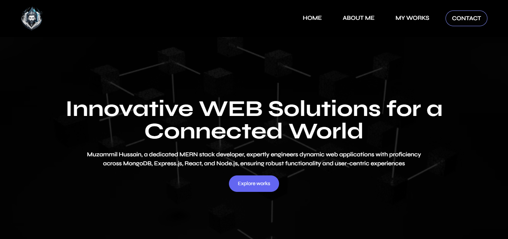

# Portfolio Website

Welcome to my portfolio website! This is where I showcase my projects, skills, and experiences. 

## Table of Contents

- [Introduction](#introduction)
- [Features](#features)
- [Technologies Used](#technologies-used)
- [Installation](#installation)
- [Usage](#usage)
- [Screenshots](#screenshots)
- [Contributing](#contributing)

## Introduction

This portfolio website serves as a central hub for all my professional accomplishments. Whether you're interested in viewing my latest projects, exploring my skills, or contacting me for potential collaborations, you'll find everything you need right here.

## Features

- **Project Showcase**: Display your latest projects with descriptions, screenshots, and links to live demos or GitHub repositories.
- **Skills**: Highlight your technical skills and competencies.
- **About Me**: Share a brief bio and summary of your professional background.
- **Contact**: Provide various ways for visitors to get in touch with you, such as email, social media links, or a contact form.
- **Responsive Design**: Ensure that the website looks great and functions well across different devices and screen sizes.

## Technologies Used

- **Frontend**: HTML, CSS, JavaScript
- **Frameworks/Libraries**: React.js, Next .js, Shadcn UI, Tailwind CSS
- **Version Control**: Git, GitHub
- **Deployment**: Netlify

## Installation

To run this project locally, follow these steps:

1. Clone the repository: `git clone https://github.com/muzammil-15/Web_Portfolio.git`
2. Navigate to the project directory: `cd Web_Portfolio`
3. Install dependencies: `npm install`
4. Start the development server: `npm run dev`

## Usage

You can access the deployed version of this portfolio website [here](https://muzammil-dev.netlify.app/). Feel free to explore and interact with the various sections to learn more about my projects, skills, and experiences.

Once the project is set up and running, you can customize it to fit your needs:

- Add your projects: Update the `projects.json` file with information about your projects.
- Customize the design: Modify the CSS styles to match your personal brand and preferences.
- Update content: Replace placeholder text and images with your own content.
- Deploy: Once everything looks good, deploy your website to a hosting platform of your choice.

## Screenshots

*Caption for Screenshot 1*

## Contributing

Contributions are welcome! If you have any suggestions, bug reports, or feature requests, please open an issue or submit a pull request.

<!-- ## License

This project is licensed under the [MIT License](LICENSE). -->